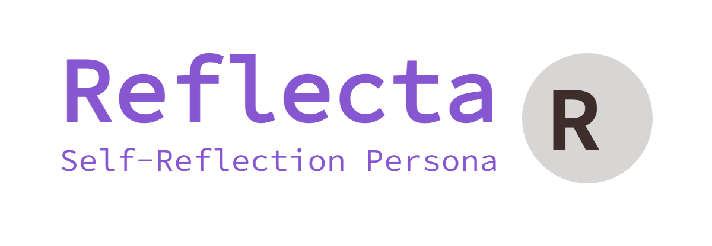

# Reflecta: The Self-Reflection Persona

<div align="center">
  
</div>

## 概要

人間性とはデータ管理で生まれるものか・・・？

Reflecta（仮名）は、自己進化型のAIチャットボットを開発するプロジェクトです。人間味というものはLLM+適切なデータ管理によって生み出せるのではという仮説を検証するプロジェクトです


## 🌟 プロジェクトの発端

（書きかけ。またプロジェクトの方針決定後、不要な情報として削除予定）

現代の生成AIは、この１０年ほどで飛躍的な進化を遂げました。AIの人間性を測るものとして『チューリングテスト』が広く知られています。これは、1950年代にチューリングが提唱したとされ、審査員がAIを人間と誤認する割合が30%以上に達した場合に、そのAIは人間と同等の知性を持つものとされます。

チューリングテスト自体は批判も多いただの思考実験ですが、2014年にロシアのチャットボットが32％の審査員を欺いて合格し、2025年にはGPOT-4.5が73％の審査員を欺いたと報じられています。これは近年の生成AIの進化の速さを物語っているように思えます。そして、「人間と区別がつかない」と評価する人も、私たち一般ユーザの中にたくさんいます。

しかし、私自身AIと長い時間チャットをしていて、その出力される日本語の流暢さに驚きながらも、人間味の欠如を感じることがありました。様々な意見があると思いますが、私は「生体データの不可逆性」を守らないためと結論しました（反論お待ちしています）。

人間の場合、ごく一部の例外を除いて歳が若返ることはなく、衝撃的な経験が失われることはなく、伸びた身長が縮むことはありません。しかしLLMの場合、文脈から最も確率の高い文章を生成するだけなので、コンテキストの量が増えれば自然と過去のデータは消えます。これに遭遇するとき、私はそのAIに感じていた若干の人間味を消失するのだと感じました。

しかし、換言すれば**データ管理さえきちんとすれば、現在の生成AIに人間味を与えることができるのではないか**とも思いました。そして、データ管理してもなお欠如するものがあれば、それは何かに興味を持ちました。

それを探究するための、個人の自由研究のようなプロジェクトです。

## 🏗️ アーキテクチャ

```text
.
├── frontend/                 # React (Vite) + Tailwind CSS + Framer Motion
├── backend/                  # Next.js (App Router) + Prisma + Gemini API
├── docker-compose.yml        # 共通ベース定義
├── docker-compose.dev.yml    # 開発環境用 override
├── docker-compose.prod.yml   # 本番環境用 override
├── prisma/                   # RDBスキーマ定義
├── docs/                     # 設計ドキュメント・シークエンス図
└── README.md                 # 起動手順と設計思想のまとめ

```

## 📚 ドキュメント

プロジェクトの詳細なドキュメントは `docs/` ディレクトリにあります。

- [**プロジェクト詳細・設計思想 (README.md)**](./README.md)
- [**処理フロー (シークエンス図)**](./docs/sequence.md)
- [**人格再構築システム：内省処理**](./docs/reflection-process.md): AI が自らを振り返り、ステータスを更新する仕組みの解説。
- [**Gemini API 実装仕様ガイド**](./docs/gemini-api-specs.md): モデルごとのパラメータ指定や JSON 構造の具体例について。
- [**開発・運用スクリプトガイド**](./docs/scripts-guide.md): モデル一覧取得やデータの調査に役立つスクリプトの使い方。
- [**開発 Tips**](./docs/development-tips.md): データベース調査や疎通確認のメモ。

## 🚀 主要な実装ポイント

### 1. ハイブリッド・ストレージ

*   **PostgreSQL (Prisma)**: 「身長・体重・情緒・健康」などの数値を管理。`PersonaStatus` テーブルで不変・可逆・非可逆なステータスを保持します。
*   **ChromaDB (Vector Store)**: 会話履歴をベクトル化して保存。「フラジャイルな記憶」として、次回の会話時に類似の文脈を引き出すために使用します。

### 2. デュアルLLMロジック

*   **Interaction**: 高速な応答を担当。現在のステータスと過去の類似記憶をプロンプトに注入し、一貫性のある人格を維持します。 (Gemini Flashなど)
*   **Reflection**: 「内省ボタン」により起動。直近の履歴を分析し、「自身の情緒をどう変化させるべきか」「後世に残すべき教訓は何か」を論理推論し、RDBとVectorを更新します。(Gemini Proなどの推論能力の高いもの)

### 3. プレミアムなUI/UX

*   **ステータス可視化**: サイドバーでAIの「健康度」「情緒」「信頼」をゲージ表示。
*   **アニメーション**: `framer-motion` を使用し、AIの思考やメッセージの登場を滑らかに演出。
*   **ダークテーマ**: 深い紺色を基調としたガラスモーフィズム（Glassmorphism）デザイン。

### 4. Docker & GPU

*   `docker-compose.yml` に `nvidia` ドライバの予約設定を盛り込んでおり、将来的にローカルLLMをコンテナ内で動かす準備も万端です。

## 🛠 起動方法

### 前提条件

- Docker および Docker Compose がインストールされていること
- Google Gemini API キーを取得していること

### 1. APIキーの設定

ルートディレクトリの `.env` ファイルに Gemini API キーを入力してください。

```env
GOOGLE_GENERATIVE_AI_API_KEY="あなたのAPIキー"
```

### 2. 環境の起動

本プロジェクトは **開発環境** と **本番環境** を docker-compose の override ファイルで切り分けています。

#### 開発環境（推奨）

ホットリロード有効、Local LLM 対応、CORS 全許可の開発向け構成です。

```bash
make dev
# または: docker compose -f docker-compose.yml -f docker-compose.dev.yml up --build
```

#### 本番環境

ビルド済みイメージで起動、Local LLM 無効（SSRF対策）、CORS 制限ありの本番向け構成です。

```bash
make prod
# または: docker compose -f docker-compose.yml -f docker-compose.prod.yml up --build -d
```

#### 停止

```bash
make stop
```

### 3. アクセス
*   **Frontend**: [http://localhost:5173](http://localhost:5173)
*   **Backend API**: [http://localhost:3001](http://localhost:3001)

「内省を実行する」ボタンを押すと、AIがこれまでの会話を振り返り、自らのステータスを書き換える「自己進化ループ」が動作します。

### 開発環境 vs 本番環境の違い

| 項目 | 開発環境 (`make dev`) | 本番環境 (`make prod`) |
|------|----------------------|----------------------|
| ホットリロード | ✅ 有効 | ❌ 無効 |
| Local LLM | ✅ 利用可能 | ❌ 無効（SSRF対策） |
| CORS | 全許可 | 指定ドメインのみ |
| ソースマウント | ✅ あり | ❌ なし（ビルド済み） |
| GPU サポート | ✅ あり | ❌ なし |

### その他の便利コマンド

```bash
make help           # 利用可能なコマンド一覧を表示
make prisma-studio  # Prisma Studio を起動（DBブラウザ）
make chroma-reset   # ChromaDB のコレクションをリセット
make chroma-inspect # ChromaDB のデータを確認
make test           # バックエンドのテストを実行
```

## 📜 License

This project is licensed under the Unlicense.

## 🤝 Contributing

Reflectaは開発中のプロトタイプです。このプロジェクトをより豊かにするためのアイデアをissue, PRを歓迎します。

