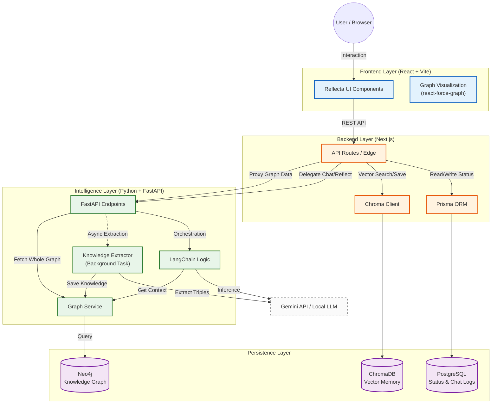

# Reflecta Architecture

Reflecta のシステム全体のアーキテクチャ図です。
フロントエンド、バックエンド(Next.js)、LLMサービス(Python)の3層構造と、3種類のデータベース(PostgreSQL, ChromaDB, Neo4j)の関係性を示しています。

```mermaid

graph TD
    %% Users
    User((User / Browser))

    %% Frontend Layer
    subgraph Frontend ["Frontend Layer (React + Vite)"]
        UI["Reflecta UI Components"]
        GraphView["Graph Visualization<br/>(react-force-graph)"]
    end

    %% Backend Layer
    subgraph Backend ["Backend Layer (Next.js)"]
        API["API Routes / Edge"]
        Prisma["Prisma ORM"]
        ChromaClient["Chroma Client"]
    end

    %% Intelligence Layer
    subgraph LLM_Service ["Intelligence Layer (Python + FastAPI)"]
        LLM_API["FastAPI Endpoints"]
        Chain["LangChain Logic"]
        Extractor["Knowledge Extractor<br/>(Background Task)"]
        GraphClient["Graph Service"]
    end

    %% Persistence Layer
    subgraph Database ["Persistence Layer"]
        Postgres[("PostgreSQL<br/>Status & Chat Logs")]
        Chroma[("ChromaDB<br/>Vector Memory")]
        Neo4j[("Neo4j<br/>Knowledge Graph")]
    end

    %% External Services
    External_AI["Gemini API / Local LLM"]

    %% Dependencies & Data Flow
    User -->|Interaction| UI
    UI -->|REST API| API
    
    %% Backend Logic
    API -->|Read/Write Status| Prisma
    Prisma --> Postgres
    API -->|Vector Search/Save| ChromaClient
    ChromaClient --> Chroma
    
    %% LLM Delegation
    API -->|Delegate Chat/Reflect| LLM_API
    
    %% Python Service Logic
    LLM_API -->|Orchestration| Chain
    Chain -->|Inference| External_AI
    
    %% Knowledge Graph RAG & Extraction
    Chain -->|Get Context| GraphClient
    GraphClient -->|Query| Neo4j
    
    LLM_API -.->|Async Extraction| Extractor
    Extractor -->|Extract Triples| External_AI
    Extractor -->|Save Knowledge| GraphClient
    
    %% Visualization Flow
    API -->|Proxy Graph Data| LLM_API
    LLM_API -->|Fetch Whole Graph| GraphClient

    %% Styling
    classDef frontend fill:#e3f2fd,stroke:#1565c0,stroke-width:2px;
    classDef backend fill:#fff3e0,stroke:#e65100,stroke-width:2px;
    classDef python fill:#e8f5e9,stroke:#2e7d32,stroke-width:2px;
    classDef db fill:#f3e5f5,stroke:#7b1fa2,stroke-width:2px;
    classDef external fill:#fafafa,stroke:#424242,stroke-width:2px,stroke-dasharray: 5 5;

    class UI,GraphView frontend;
    class API,Prisma,ChromaClient backend;
    class LLM_API,Chain,Extractor,GraphClient python;
    class Postgres,Chroma,Neo4j db;
    class External_AI external;
    
```
