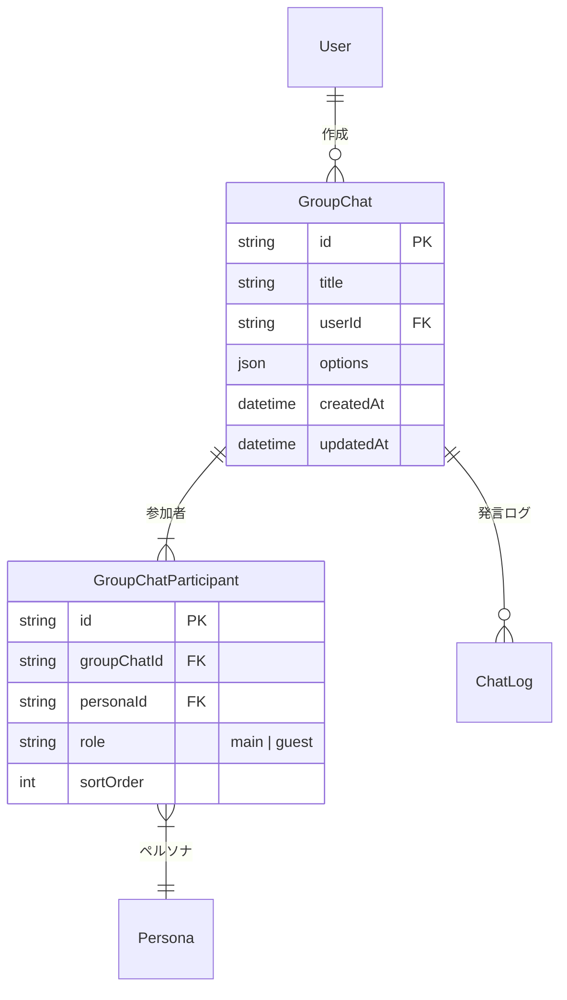

# グループチャット（マルチペルソナ）アーキテクチャ

## 概要

Reflecta のグループチャット機能は、**1つのチャットセッションに複数のペルソナ（AI人格）を参加させ、ユーザーの発言に対してペルソナが交互に応答する**仕組みです。

各ペルソナは独立したステータス（性格・感情・身体情報）を持ち、LLM はそれらの情報を踏まえて「そのキャラクターらしい」応答を生成します。

---

## データモデル



### テーブル

| テーブル | 役割 |
|----------|------|
| `group_chats` | グループチャットセッション。1:1の `chats` テーブルとは独立 |
| `group_chat_participants` | 中間テーブル。ペルソナとグループチャットを多対多で紐付け |

### 1:1チャットとの分離

`chats` テーブル（1:1）と `group_chats` テーブル（複数ペルソナ）は完全に分離しています。  
`ChatLog` は `chatId`（1:1用）または `groupChatId`（グループ用）のいずれか一方を持ちます。

---

## LLM への指示の送り方

### 全体フロー

```
ユーザー発言
    ↓
Backend (chat/route.ts)
    ├── 参加ペルソナ一覧を取得
    ├── 各ペルソナの最新ステータスを取得
    ├── ラウンドロビンで次の発言者を決定
    └── Python Service に送信
            ↓
Python Service (chat.py)
    ├── build_system_instruction() でシステムプロンプトを構築
    │       ├── メインペルソナのフルステータス（通常の1:1と同じ内容）
    │       ├── ★ 全参加者の要約ステータス（グループチャット固有）
    │       └── ★ 次の発言者の指定（グループチャット固有）
    └── LLM に送信 → 応答を返却
```

### プロンプト構造

グループチャット時のシステムプロンプトは、1:1チャットのプロンプトに以下のセクションが**追加**されます。

```
（通常の1:1プロンプトと同じ内容）
- ペルソナ名、性格、身体情報、記憶、etc.

### グループチャット参加者          ← ★ 追加
この会話には複数のキャラクターが参加しています。

#### 1. アリス（メイン）
- 性別: 女性
- 情緒: 70/100
- 信頼度: 60/100
- 親しみやすさ: 80/100
- 身長: 165cm / 体重: 52kg

#### 2. ボブ（ゲスト）
- 性別: 男性
- 情緒: 45/100
- 信頼度: 55/100
- ...

### 発言指示                        ← ★ 追加
次に発言するキャラクターは「ボブ」です。
このキャラクターの性格と現在の状態に基づいて、
そのキャラクターとして応答してください。
応答の冒頭にキャラクター名を付ける必要はありません。
```

### ポイント

- **メインペルソナのステータスはフル情報**（身体制約、成長記録、記憶など全て）で送られる
- **他の参加者は要約情報**（情緒・信頼度・親しみやすさなど主要パラメータのみ）で送られる
- 各ペルソナの `systemPrompt`（性格設定テキスト）も含まれる

---

## ラウンドロビン発言

ユーザーが1回メッセージを送るたびに、**1人のペルソナ**が応答します。  
次にどのペルソナが発言するかは、**直前の assistant ログの発言者の次のペルソナ**が選ばれます。

```
参加者: [アリス, ボブ, キャロル]  (sortOrder順)

ユーザー → アリスが応答  (初回: sortOrder=0)
ユーザー → ボブが応答    (アリスの次)
ユーザー → キャロルが応答 (ボブの次)
ユーザー → アリスが応答   (キャロルの次 → 循環)
```

### 実装箇所

```typescript
// backend/src/app/api/chat/route.ts

// 直前のassistantログから発言者を特定
const lastAssistantLog = await prisma.chatLog.findFirst({
    where: { groupChatId, role: 'assistant' },
    orderBy: { createdAt: 'desc' },
});

// 次のペルソナをラウンドロビンで選択
const lastIdx = participants.findIndex(p => p.personaId === lastAssistantLog.personaId);
const nextIdx = (lastIdx + 1) % participants.length;
```

---

## API エンドポイント

### グループチャット管理

| Method | Endpoint | 説明 |
|--------|----------|------|
| `GET` | `/api/group-chats` | 一覧取得（`personaId` フィルタ対応） |
| `POST` | `/api/group-chats` | 新規作成（`personaIds` 2つ以上必須） |
| `GET` | `/api/group-chats/:id` | 詳細+ログ取得（カーソルページネーション） |
| `PATCH` | `/api/group-chats/:id` | タイトル・オプション更新 |
| `DELETE` | `/api/group-chats/:id` | 削除（参加者も Cascade 削除） |

### メッセージ送信

グループチャットのメッセージ送信は、既存の `/api/chat` エンドポイントを共用します。

```json
POST /api/chat
{
  "message": "こんにちは",
  "groupChatId": "xxx-xxx-xxx",   // ← グループチャット時に指定
  "personaId": "yyy-yyy-yyy",
  "llmConfig": { ... }
}
```

`groupChatId` が指定されると、バックエンドは自動的に：
1. 参加者全員のステータスを取得
2. ラウンドロビンで次の発言者を決定
3. プロンプトに参加者情報を注入
4. `ChatLog` を `groupChatId` に紐付けて保存

---

## フロントエンド UI

Chat History サイドバーにタブ切り替え UI を導入し、**1:1** タブと **Group** タブでチャット一覧を分離しています。

- **1:1 タブ**: 従来の1対1チャット一覧
- **Group タブ**: グループチャット一覧（参加ペルソナ名をバッジ表示）

Group タブの **+** ボタンを押すと `GroupChatCreationModal` が開き、ペルソナを2つ以上選択してグループチャットを作成できます。

---

## 今後の拡展（フェーズ3以降）

- **双方向内省**: グループチャット内の全参加ペルソナに対して内省を実行
- **発言戦略の多様化**: ラウンドロビン以外（自然発話検知、テーマ別指名など）
- **ペルソナ同士の直接対話**: ユーザーメッセージなしでペルソナ間が会話する機能
