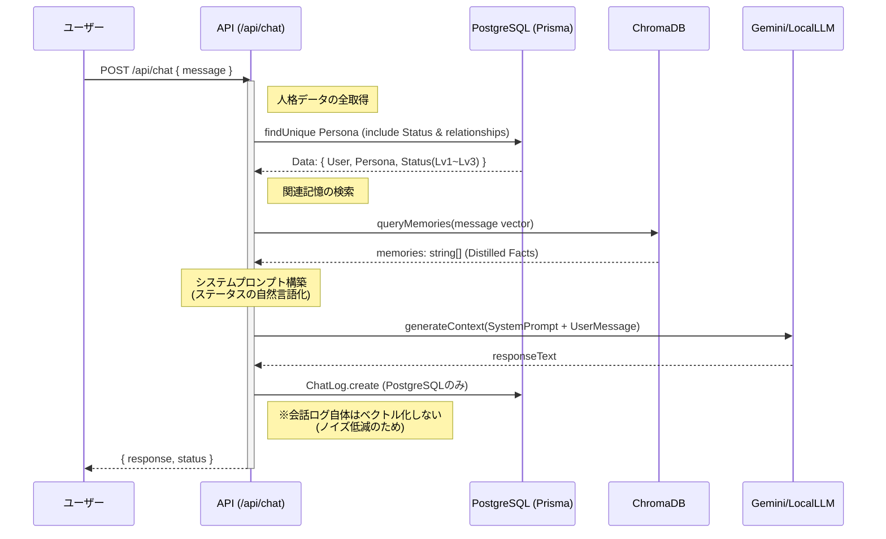
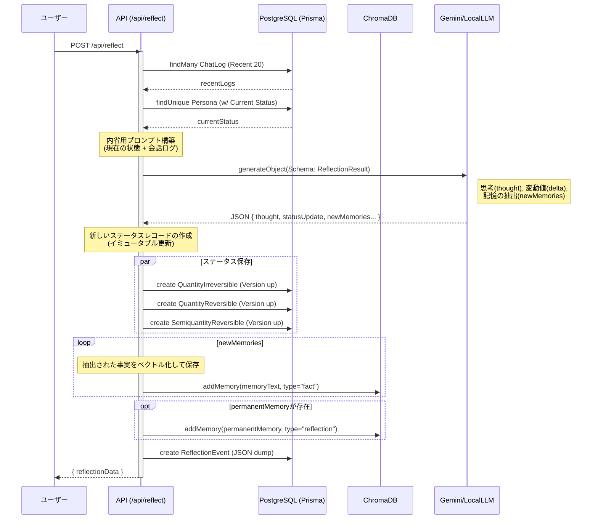

# Reflecta 処理フロー詳細設計

このドキュメントでは、Reflecta の主要な処理フロー（チャットと内省）について、**データベース(PostgreSQL)との具体的なデータのやり取り**と、**LLMへのプロンプト構築ロジック**を詳細に定義します。

## 1. チャット処理 (Chat Interaction)

ユーザーの発言に対して、現在の人格ステータスと過去の記憶を踏まえた応答を生成します。

### 1-1. シークエンス図



Note: queryMemories()でChromaDBから取得する関連記憶のデフォルト値は3つ。

### 1-2. データ取得とプロンプトへのマッピング

`Persona` テーブルを起点に、現在の `PersonaStatus` に紐づく詳細データ（Lv1〜Lv3）を一括取得 (`include`) します。取得したデータは、システムプロンプト内で以下のように自然言語化され、AIの「自己認識」として機能します。

#### 取得データ構造 (Prisma)

```typescript
// backend/src/app/api/chat/route.ts での想定クエリ
const persona = await prisma.persona.findUnique({
  where: { id: personaId },
  include: {
    status: { // currentStatus
      include: {
        quantityUnchange: true,       // Lv1-1: 生年月日, 性別など
        semiquantityUnchange: true,   // Lv1-2: 性格特性 (倫理など)
        quantityIrreversible: true,   // Lv2: 身長, 骨密度
        quantityReversible: true,     // Lv3-1: 体重, 睡眠 (JSON)
        semiquantityReversible: true, // Lv3-2: 気分, 信頼度 (JSON)
      }
    }
  }
});
```

#### プロンプト構成テンプレート

LLMに渡す `System Instruction` は、各テーブルのデータを元に以下のセクションで構成されます。

| セクション | 参照元テーブル | プロンプト記述例 (自然言語化) | 役割 |
| :--- | :--- | :--- | :--- |
| **基本プロフィール** | `QuantityUnchangeStatus` | 名前: Reflecta<br>年齢: 18歳 (birthDateより算出)<br>性別: 女性 | AIの基本的な自己定義。<br>ブレない人格の核。 |
| **性格・気質** | `SemiquantityUnchangeStatus` | **性格特性:**<br>- 好奇心: 旺盛 (Val: 80)<br>- 倫理観: 普通 (Val: 50) | 応答のトーンや、<br>提案内容の傾向に影響。 |
| **身体的特徴** | `QuantityIrreversibleStatus`<br>`QuantityReversibleStatus` | **身体状態:**<br>身長: 158cm, 体重: 46kg<br>睡眠時間: 6.5時間 (質: 7/10) | 物理的な実在感を演出。<br>「眠い」等の表現根拠。 |
| **現在の状態** | `SemiquantityReversibleStatus` | **現在のコンディション:**<br>- 気分: 70/100 (良好)<br>- 健康: 95/100<br>- ユーザーへの信頼度: 60/100 | 文脈に応じた感情表現。<br>親密度による口調変化。 |
| **長期記憶 (Distilled)** | `ChromaDB` (Reflections) | **関連する記憶:**<br>- ユーザーはコーヒーが好きだ<br>- 以前名前を間違えられた | 過去の文脈を踏まえた応答。<br>**内省で抽出された重要事実のみ**。 |

---

## 2. 内省処理 (Self Reflection)

「Self Reflect」ボタン押下時にトリガーされます。直近の会話ログを分析し、**ステータスの更新**と**重要な記憶の抽出（蒸留）**を行います。

詳細は [内省処理](./reflection-process.md) を参照。

### 2-1. シークエンス図



### 2-2. 記憶の蒸留 (Memory Distillation)

Reflecta の最大の特徴は、**「全ての会話を覚えるのではなく、重要なことだけを覚える」** 点にあります。

1.  **Raw Logs (PostgreSQL)**:
    *   全ての会話 (`ChatLog`) は PostgreSQL に保存されますが、これらは直接ベクトル検索の対象にはなりません（ノイズ過多のため）。
2.  **Reflection (LLM)**:
    *   内省プロセスで、LLM が直近の会話から「永続的に覚えておくべき事実」を `newMemories` として抽出します。
    *   例：「ユーザーは辛いものが苦手だ」「来週旅行に行くと言っていた」
3.  **Distilled Memories (ChromaDB)**:
    *   抽出された `newMemories` だけが ChromaDB に保存されます。
    *   次回のチャット時、検索対象となるのはこの「蒸留された記憶」のみです。これにより、検索精度と文脈一致度が飛躍的に向上します。
