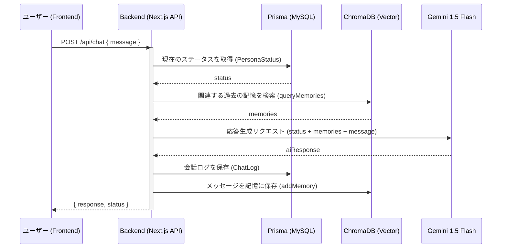
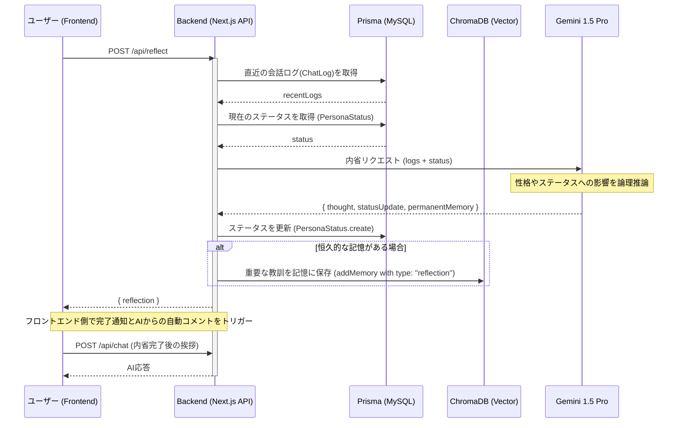

# Reflecta シークエンス図

このドキュメントでは、Reflecta の主要な処理フロー（チャットと内省）を Mermaid 形式のシークエンス図で定義します。

## 1. チャット処理 (Chat Interaction)

ユーザーとの対話時のフローです。Gemini 1.5 Flash を使用して高速に応答を生成し、ステータスや記憶を考慮します。

## 2. 内省処理 (Self Reflection)

「Self Reflect」ボタン押下時のフローです。Gemini 1.5 Pro を使用して論理的な推論を行い、自己のステータスや恒久的な記憶を更新します。

