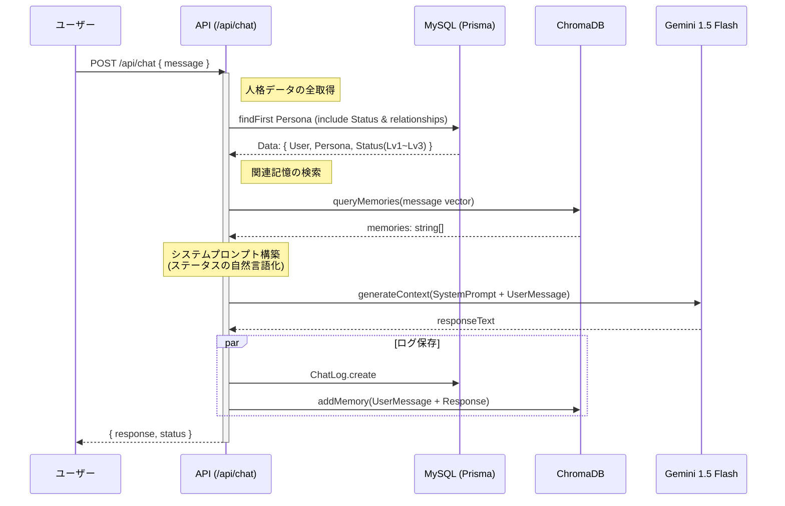
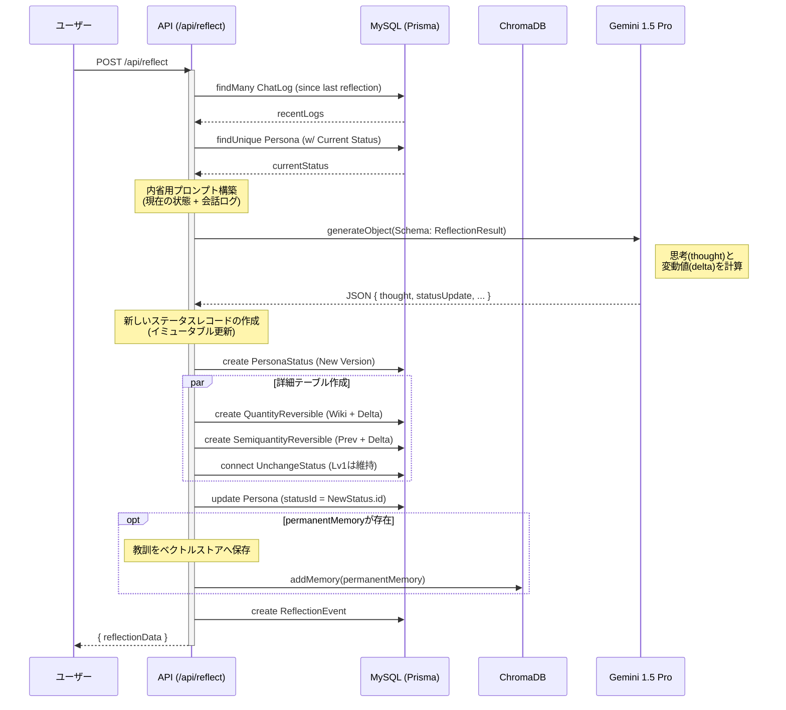

# Reflecta 処理フロー詳細設計

このドキュメントでは、Reflecta の主要な処理フロー（チャットと内省）について、**データベース(MySQL)との具体的なデータのやり取り**と、**LLMへのプロンプト構築ロジック**を詳細に定義します。

## 1. チャット処理 (Chat Interaction)

ユーザーの発言に対して、現在の人格ステータスと過去の記憶を踏まえた応答を生成します。Gemini 1.5 Flash を使用して高速に応答します。

### 1-1. シークエンス図



### 1-2. データ取得とプロンプトへのマッピング

`Persona` テーブルを起点に、現在の `PersonaStatus` に紐づく詳細データ（Lv1〜Lv3）を一括取得 (`include`) します。取得したデータは、システムプロンプト内で以下のように自然言語化され、AIの「自己認識」として機能します。

#### 取得データ構造 (Prisma)

```typescript
// backend/src/app/api/chat/route.ts での想定クエリ
const persona = await prisma.persona.findUnique({
  where: { id: personaId },
  include: {
    status: { // currentStatus
      include: {
        quantityUnchange: true,       // Lv1-1: 生年月日, 性別など
        semiquantityUnchange: true,   // Lv1-2: 性格特性 (倫理など)
        quantityIrreversible: true,   // Lv2: 身長, 骨密度
        quantityReversible: true,     // Lv3-1: 体重, 睡眠
        semiquantityReversible: true, // Lv3-2: 気分, 信頼度
      }
    }
  }
});
```

#### プロンプト構成テンプレート

LLMに渡す `System Instruction` は、各テーブルのデータを元に以下のセクションで構成されます。

| セクション | 参照元テーブル | プロンプト記述例 (自然言語化) | 役割 |
| :--- | :--- | :--- | :--- |
| **基本プロフィール** | `QuantityUnchangeStatus` | 名前: Reflecta<br>年齢: 18歳 (birthDateより算出)<br>性別: 女性 | AIの基本的な自己定義。<br>ブレない人格の核。 |
| **性格・気質** | `SemiquantityUnchangeStatus` | **性格特性:**<br>- 好奇心: 旺盛 (Val: 80)<br>- 倫理観: 普通 (Val: 50) | 応答のトーンや、<br>提案内容の傾向に影響。 |
| **身体的特徴** | `QuantityIrreversibleStatus`<br>`QuantityReversibleStatus` | **身体状態:**<br>身長: 158cm, 体重: 46kg<br>睡眠時間: 6.5時間 (質: 7/10) | 物理的な実在感を演出。<br>「眠い」等の表現根拠。 |
| **現在の状態** | `SemiquantityReversibleStatus` | **現在のコンディション:**<br>- 気分: 70/100 (良好)<br>- 健康: 95/100<br>- ユーザーへの信頼度: 60/100 | 文脈に応じた感情表現。<br>親密度による口調変化。 |
| **短期記憶・文脈** | `ChromaDB`<br>`ChatLog` | **関連する記憶:**<br>- (過去の会話の要約)<br>**直近の会話:**<br>User: ...<br>AI: ... | 一貫性のある会話維持。<br>同じ話題の繰り返し防止。 |

---

## 2. 内省処理 (Self Reflection)

「Self Reflect」ボタン押下、または会話終了時にトリガーされます。Gemini 1.5 Pro を使用し、直近の出来事を振り返り、Lv3（可変）ステータスを論理的に更新します。

### 2-1. シークエンス図



### 2-2. 内省ロジック詳細

内省処理では、**「会話ログからステータスの変動値を算出する」** ことが目的です。

#### LLMへの入力 (Input Prompt)

1.  **現在のステータス**: チャット時と同様に全ステータスを提示。
2.  **評価対象のログ**: 前回の内省以降の `ChatLog` リスト。
3.  **内省ルール**:
    *   `mood` (気分) は会話の内容（ポジティブ/ネガティブ）によって -10 ~ +10 の範囲で変動する。
    *   `trust` (信頼度) はユーザーの共感や肯定によって上昇し、否定によって下降する。
    *   `stress` (血圧等に影響) は長時間の会話や複雑な話題で上昇する。

#### LLMからの出力 (Output Schema)

JSON形式で結果を受け取ります（`generateJson` 関数を使用）。

```json
{
  "thought": "ユーザーは私の記憶力について褒めてくれたため、自己効力感が高まり、気分が向上した。一方で、夜遅い時間のため疲労が蓄積していると判断する。",
  "modifications": {
    "semiquantityReversible": {
      "mood": 5,      // 現在値 + 5
      "trust": 2,     // 現在値 + 2
      "health": -1    // 疲労により -1
    },
    "quantityReversible": {
      "sleepQuality": 0, // 変化なし
      "bloodPressureSys": 2 // 興奮により微増
    }
  },
  "newMemory": "深夜の会話は楽しいが、エネルギーを消費する傾向があることを学んだ。"
}
```

#### データベース更新手順 (Immutability Strategy)

**重要:** `PersonaStatus` は履歴を残すため、**UPDATEではなくINSERT (Create New)** を行います。これにより、過去のどの時点でどのような心理状態だったかを全て遡及可能にします。

1.  新しい `PersonaStatus` レコードを作成。
2.  **不変データ (Lv1)**: 既存の `QuantityUnchangeStatus` IDを新ステータスに紐付け (Connect)。これは変化しないためコピー不要です。
3.  **可変データ (Lv3)**: 直近の値に LLMが算出した変動値 (`delta`) を加算し、**新しいレコードを作成** して紐付けます。
4.  `Persona.statusId` を新しい `PersonaStatus.id` に更新し、現在のアクティブな状態とします。

#### 記憶の保存 (Vector Store)

LLMが `newMemory` (または `permanentMemory`) を生成した場合、重要な教訓や事実として ChromaDB に保存されます。

*   **保存内容**: `newMemory` のテキスト。
*   **メタデータ**: 生成時の `persona_id` や `created_at` を付与。
*   **目的**: 次回のチャット時、類似性の高いトピックとして検索され、文脈として取り込まれるようになります。
